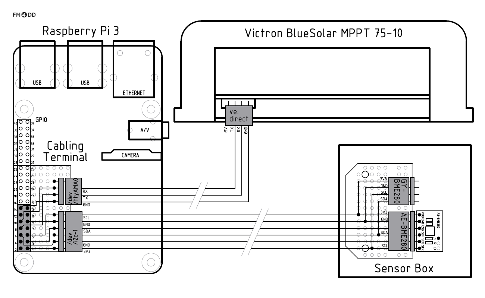

# Pi-Weather Design and Build Documentation

This folder contains documentation for the physical build of the outdoor weather station and the weather display. It includes CAD drawings, wiring schemas, bill of materials (BOM) and build pictures.

## Weather Display, Version 1.0

A permanent weather display was on the back of my mind. A 20x4 LCD character display for displaying the weather stations data, and a 5 inch TFT screen for showing the graphs. The control unit is a Raspberry Pi A Plus. It is interfacing with the TFT display though a HDMI board, and through an I2C with the character LCD. 

    

    

## Weather Station, Version 1.1

 After five months of operation, the weather stations sensor AM2302 started to fail, with humidity getting stuck permanently at 100%. Research found this is a common and rather frequent problem. The search of an alternate sensor lead to the Bosch BME280. It offered several benefits by combining temperature, humidity and air pressure in one small package. The I2C interface seemed easier to handle than the non-standard bit-banging protocol of the AM2302. A suitable case was found for housing the BME280 sensor, and the wood frame received small changes to reduce manufacture effort. The sensor is made pluggable for easy replacement.

   

This version started to use the Raspberry Pi 3 with built-in WiFi for network connectivity. Together with the new sensor case, the interface wiring slightly changed from version 1.0. A serial line addition is prepared to obtain data from a Victron charge controller (solar-powered "off-the-grid" operation).

## Weather Station, Version 1.0

This was the first weather station build. It used a AM2302 temperature/humidity sensor from <a href="http://www.aosong.com/en/home/index.asp">Aosong</a>. After functional tests confirmed the sensors function, a suitable weather-proof box for housing the Raspberry Pi was found at <a href="https://www.conrad.de/">Conrad</a>, Bettermans junction box <a href="https://obo.de/article/display/en-wo/junction-box-t-100-plug-in-seal.html">OBO T100</a>.

   

With the AM2302 sensor working, adding Raspberry Pi camera required a suitable mount. The wooden frame was drawn up and made.

After 3 months of operation, a second sensor Bosch BMP180 has been added through i2C for recording barometric air pressure. The wiring schematics below show the connectivity.

