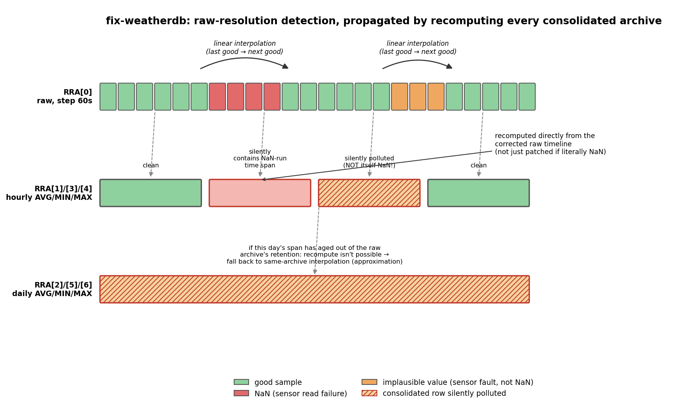

# fix-weatherdb

Finds and (optionally) fixes bad samples in a weather-station RRD database,
including the cases where a fault propagates silently into RRDtool's
consolidated (aggregated) archives.



## 1. Background

The weather station (`getsensor`) writes readings for four data sources
into an RRD every 60 seconds. Sensors occasionally fail to produce a valid
reading. This shows up in the database in one of two ways:

- **NaN** - the sensor read outright failed and no value was written for
  that step.
- **An implausible value** - the sensor returned a *number*, but one that's
  physically nonsensical given the surrounding readings (e.g. a momentary
  `-2 °C` reading in the middle of a `25 °C` day). This is worse than a NaN,
  because RRDtool has no way to know it's wrong - it gets treated exactly
  like a real measurement.

`fix-weatherdb` finds both kinds of fault over a requested lookback period
and, if asked, repairs them by linear interpolation.

## 2. The RRD structure it operates on

This tool is written against the specific schema used by `weather.rrd`:

| Data source | Type   | Range           | Fixed by this tool? |
|---|---|---|---|
| `temp` | GAUGE | -100..100 °C     | yes |
| `humi` | GAUGE | 0..100 %         | yes |
| `bmpr` | GAUGE | 0..200000 Pa     | yes |
| `dayt` | GAUGE | 0..1 (day/night flag) | **no** - a boolean flag isn't a continuous quantity; interpolating it would produce meaningless fractional values |

Archives (`RRA`s), by index, as created for this station:

| RRA | Function | Native resolution | Retention |
|---|---|---|---|
| 0 | AVERAGE | 60s (raw)   | 20160 rows (~14 days) |
| 1 | AVERAGE | 3600s (1h)  | 17568 rows (~2 years) |
| 2 | AVERAGE | 86400s (1d) | 7320 rows (~20 years) |
| 3 | MIN     | 3600s (1h)  | 17568 rows |
| 4 | MAX     | 3600s (1h)  | 17568 rows |
| 5 | MIN     | 86400s (1d) | 7320 rows |
| 6 | MAX     | 86400s (1d) | 7320 rows |

All consolidated archives use `xff = 0.5` - i.e. a consolidated row still
produces a value as long as fewer than half of the underlying raw points
feeding it are unknown; beyond that, RRDtool gives up and the row is NaN.

## 3. Detection method

### 3.1 Raw resolution only

Both fault types are only ever *detected* against `RRA[0]`, the raw,
native-step archive. "Sudden jump" is only a meaningful test at native
resolution - an hourly or daily average can legitimately move by a large
amount during real weather, so the same absolute-threshold test can't be
applied at coarser resolutions without producing false positives.

- **NaN**: a literal NaN in the raw archive.
- **Implausible value**: compared against the mean of the last **5** good
  (non-bad) raw samples for that data source. If a reading deviates from
  that rolling baseline by more than a threshold, it's flagged:

  | Data source | Threshold |
  |---|---|
  | `temp` | 15 °C |
  | `humi` | 30 percentage points |
  | `bmpr` | 1000 Pa (10 hPa) |

  These are `#define`s at the top of `fix-weatherdb.c` and can be retuned
  without touching any logic. They're intentionally loose: real weather
  (e.g. a typhoon's pressure drop) moves far slower than a sensor glitch, so
  the goal is to only catch readings that are clearly physically wrong, not
  to flag genuine fast-moving weather.
  A reading only gets judged once at least 3 good samples have been
  collected for its rolling baseline; before that, anything non-NaN is
  accepted (there's not yet enough history to judge it).

A run of one or more consecutive bad raw samples (NaN, implausible, or a
mix of both) is bounded by the last good value *before* it and the first
good value *after* it, then linearly interpolated in time between those two
points. A run that isn't bounded on both sides (e.g. the sensor is *still*
down, or the run starts right at the edge of the database's history) is
reported but left untouched - there's nothing to interpolate towards.

### 3.2 Why the consolidated archives need separate handling

A literal NaN is excluded from RRDtool's own consolidation math. An
implausible-but-numeric value is **not** - it gets averaged/min'd/max'd in
like any other real number. That means a bad raw sample can leave the
hourly or daily archive containing a real, wrong, non-NaN number, with no
outward sign anything is wrong. Scanning each consolidated archive for
literal NaN (as the raw archive is scanned) would completely miss this.

### 3.3 Recompute from the corrected raw timeline

Once the raw archive's bad runs have been interpolated, every row of every
consolidated archive that overlaps a bad time span is **recomputed directly
from the corrected raw data** - a fresh AVERAGE/MIN/MAX over that row's
exact time window, using the archive's own `xff` to decide whether enough
of the underlying data was known. This is compared against - and, with
`-w`, replaces - whatever was already stored there, regardless of whether
that stored value happened to look "fine".

### 3.4 Fallback when raw data has aged out

The raw archive only retains ~14 days. If a consolidated row's time span is
older than that, there's no corrected raw data left to recompute it from.
In that case the tool falls back to the older, simpler method: linear
interpolation using that archive's own neighbouring valid rows. This can
still only catch a literal NaN at that point - an implausible-but-numeric
value in a consolidated row that's aged out of raw retention is
undetectable, since there's no longer any raw evidence that it's wrong.

## 4. Usage

```
fix-weatherdb -f <rrd-file> -b <Nd|Nh> [-w] [-d]
fix-weatherdb -h
```

| Option | Meaning |
|---|---|
| `-f <file>` | Full path to the RRD database to analyze/fix. |
| `-b <Nd or Nh>` | Lookback window, e.g. `7d` or `48h`. Window is `[now-N, now]`. |
| `-w` | Commit fixes to the database. Without it, only reports findings. |
| `-d` | Debug output: every bad row and every consolidated archive row touched. |
| `-h` | Help. |

```
./fix-weatherdb -f /home/pi/pi-ws01/rrd/weather.rrd -b 7d
./fix-weatherdb -f /home/pi/pi-ws01/rrd/weather.rrd -b 48h -w
```

Default (non-debug) console output reports each bounded gap at raw
resolution, its composition (how many samples were NaN vs. implausible),
and, with `-w`, a summary of how many points were written per data source
per archive.

## 5. Safety

- `rrd_dump()`/`rrd_restore()` (the same public API `rrdtool` itself uses)
  are used instead of poking the binary file format directly.
- Before any write, the original file is copied to `<file>.bak`.
- The fixed database is built in a temp file in the *same directory* as the
  target (so the final replace is an atomic `rename()`), and only swapped
  in after a successful restore.

## 6. Known limitations

- A bad run touching either edge of the database's retained history (still
  ongoing, or older than all retained data) can't be interpolated and is
  reported as unresolved.
- Right at the raw-retention boundary (~14 days back), a same-archive
  fallback run that started just before the boundary won't see a recompute
  fixed value just after the boundary as its "next good" neighbour; this is
  a deliberately conservative edge case (better to leave a row untouched
  than guess wrong at that boundary).
- Thresholds are static and don't vary by season or time of day; very rapid
  legitimate weather changes close to the threshold values could in theory
  still be flagged. Retune the `THRESH_*` constants if this happens for your
  station's climate.
