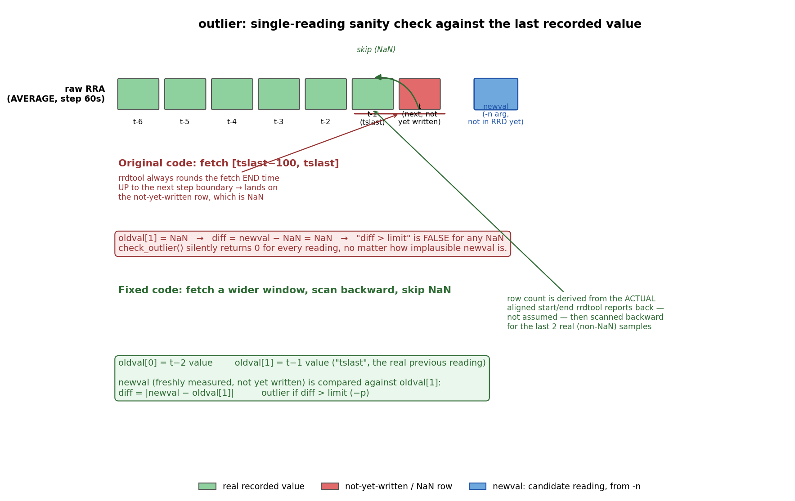

# outlier

THe program "outlier" is a pre-write sanity check. It is given a freshly
measured sensor value that is *about to be written* to the RRD, and compares
it against the last recorded RRD value for that data source.
It checks whether the new measurement is implausible before it gets written to
the RRD database. It returns '0' if the measurement looks plausible, and '1'
if the measurement is too far outside of a expected deviation range.



## 1. Purpose

`outlier` is meant to run **inline**, as part of the read/write cycle:

1. `getsensor` takes a fresh reading.
2. `outlier` is called with that reading (`-n`) before it's written.
3. If `outlier` returns 1, the caller can choose to retry the sensor read
   (or fall back to a second sensor), instead of ever writing the bad value.

Because of this, `outlier` only ever needs to know about **one previous
value** - the last one actually recorded - not a rolling window.

## 2. What it reads from the RRD

`outlier` doesn't need to know anything about the station's full archive
schema. It only calls `rrd_fetch_r()` with consolidation function
`AVERAGE`, for a short window ending at `rrd_last_r()` (the RRD's
`last_update` timestamp). From that single fetch it gets back both the data
source names (`ds_namv`) - used to resolve which column corresponds to the
`-d` argument - and the values themselves, so no separate lookup of the
database's `DS` list is required.

## 3. Detection method

### 3.1 Fetching the last real value

`rrd_fetch_r()`'s start/end times are always rounded outward to the
archive's step boundaries: **start** rounds down, **end** rounds up. Since
`last_update` is the *exact* wall-clock time of the last `rrdtool update`
call (not necessarily aligned to a clean 60-second boundary), a naive fetch
ending exactly at `last_update` gets rounded up past the real last row and
onto the *next, not-yet-written* row - which is always NaN.

`outlier` fetches a window wide enough to comfortably contain several past
steps, then uses the *actual* aligned start/end/step values that
`rrd_fetch_r()` reports back (not the originally requested ones) to work
out how many rows really came back, and scans backward from the newest row
looking for the most recent 2 non-NaN samples for the requested data
source - skipping over any trailing not-yet-written row.

### 3.2 The comparison

```
diff = | newval − oldval[most recent real value] |
outlier if diff > limit          (limit is the -p argument)
```

`newval` is the value passed on the command line via `-n` - a reading that
hasn't been written to the RRD yet. `oldval` holds the last two genuinely
recorded values for the requested data source (`oldval[1]` being the most
recent); only `oldval[1]` is used in the comparison itself, `oldval[0]` is
fetched as available context for the caller (via `-v`) but isn't required
by the check.

### 3.3 Return code

| Exit code | Meaning |
|---|---|
| 0 | `newval` is within `limit` of the last recorded value - looks fine. |
| 1 | `newval` deviates from the last recorded value by more than `limit` - looks like a bad reading. |
| -1 (255) | Error: bad arguments, can't open the RRD, unknown data source, or not enough valid recent history to compare against. |

## 4. Usage

```
outlier -s <rrd-file> -d <datasource> -n <newvalue> -p <variance> [-v] [-h]
```

```
./outlier -s /opt/raspi/data/am2302.rrd -d temp -n 9.2 -p 5
```

`-v` prints the resolved data-source index, the fetch window actually used,
each row scanned (and whether it was skipped as NaN), and the final
diff/limit comparison.

## 5. Known limitations

- A single fixed `-p` variance is used regardless of time of day or season;
  a fast but legitimate change (e.g. right at sunrise) close to the
  threshold could in principle be flagged. Unlike `fix-weatherdb`, there's
  no rolling multi-sample baseline here by design - it's meant to be a fast,
  stateless, single-reading gate, not a historical-data repair pass.
- If the RRD doesn't yet have 2 valid recorded values to compare against
  (e.g. right after creation, or after a long prior outage), `outlier` exits
  with an error rather than a pass/fail verdict - the caller should treat
  that as "can't judge yet", not as "value accepted".

# 6. Reference

There is also the more sphisticated program `fix-weatherdb`, which repairs
measurement faults that made it into the RRD database. `fix-weatherdb` uses
a rolling multi-sample baseline for higher accuracy of failure detection.
The detection method can be standardized between the two eventually.

For now, this program and `fix-weatherdb`'s raw-resolution outlier check are
intentionally different in method (single-previous-value vs. rolling
baseline) and use separate threshold values, to avoid cascading changes
to scripts that depend on `outlier`'s existing `-p` argument and behaviour.
